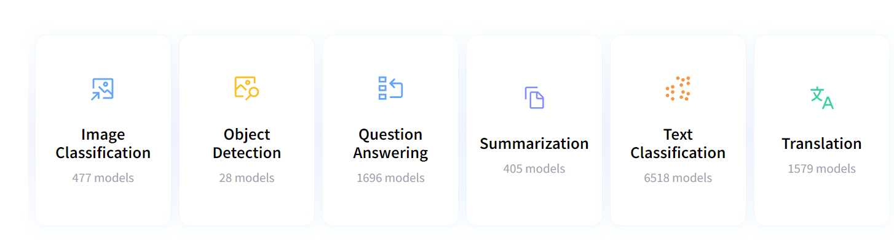

## 2022.05.08

### 1.GitHub大文件提交远程仓库

标注将大文件提交至远程大文件服务器：

```
git lfs migrate import --include="pro_03/data/train.csv"
git lfs migrate import --include="pro_03/data/test.csv"
git lfs migrate import --include="pro_04/data/creditcard.csv"
```

提交完成：

```
migrate: Fetching remote refs: ..., done
migrate: Sorting commits: ..., done
migrate: Rewriting commits: 100% (1/1), done
```

推送到远程仓库：

```
git push origin -u master
```

现在可将大文件对象提交到远程服务器：

```
Connection to ssh.github.com closed by remote host.s
Uploading LFS objects: 100% (2/2), 323 MB | 542 KB/s, done
```

继续将所有文件推送至远程仓库：

```
git push origin -u master
```

可以看到，推送完成：

```
Uploading LFS objects: 100% (2/2), 323 MB | 0 B/s, done
Enumerating objects: 93, done.
Counting objects: 100% (93/93), done.
Delta compression using up to 8 threads
Compressing objects: 100% (83/83), done.
Writing objects: 100% (93/93), 29.14 MiB | 567.00 KiB/s, done.
```

### 2.multi-label classifier error

对多标签的训练集进行分类模型训练时，出现如下报错：

```
sklearn\discriminant_analysis.py", line 782, in fit     raise ValueError('The number of classes has to be greater than' ValueError: The number of classes has to be greater than one; got 1 class
```

加上下面语句予以解决：

```
y_train = y_train.astype(np.int8)
```

## 2022.05.09

### 1.value error

```
ValueError: invalid literal for int() with base 10: ''
```

str int数据类型之间的转换，解决方式：

`int(float(item))`

类似于将'1.0'转换为1。

## 2022.05.10

### 1.ml model explaining

Machine learning models are usually seen as a “black box.” It takes some features as input and produces some predictions as output. The common questions after model training are:

* How do different features affect the prediction results?
* What are the top features that influence the prediction results?
* The model performance metrics look great, but should I trust the results?

为了说明不同的特征如何影响模型表现，以及找出影响模型预测结果的重要特征，需要对模型进一步解释。采用[SHAP](https://shap.readthedocs.io/en/latest/index.html)对模型进行解释。SHAP表示 “SHapley Additive exPlanations”，SHAP值的实质是衡量团队中每个成员对最终结果的贡献，通过SHAP值可以衡量输入特征对单个预测结果的贡献大小。SHAP适用于基于树的机器学习模型解释，如XGBoost、LightGBM、CatBoost、Pyspark等。

计算特征的SHAP值：

```
import shap

explainer = shap.TreeExplainer(mdl)
shap_values = explainer.shap_values(X_test)
```

特征重要性：

```
shap.summary_plot(shap_values, X_test, plot_type='bar')
```

特征影响方向：

```
shap.summary_plot(shap_values, X_test)
```

### 2.PackageNotFoundError

在pycharm中安装python库，在python package中搜索到之后点击安装，出现错误。

解决办法：

```
conda install -c conda-forge <package>
```

或者直接采样pip安装：

```
pip install <package>
```

### 3.已安装的vscode插件

* conbalt2 theme official
* git graph
* jupyter
* markdown all in one
* markdown preview enhanced
* markdown index
* office viewer

## 2022.05.11

### 1.save & load model

```
from sklearn.externals import joblib

# save
joblib.dump(model , 'model_jlib')

# load
m_jlib = joblib.load('model_jlib')

# predict
m_jlib.predict([[5000]]) # similar
```

## 2022.05.14

### 1. workflow of ml

1. State the question and determine required data
2. Acquire the data in an accessible format
3. Identify and correct missing data points/anomalies as required
4. Prepare the data for the machine learning model
5. Establish a baseline model that you aim to exceed
6. Train the model on the training data
7. Make predictions on the test data
8. Compare predictions to the known test set targets and calculate performance metrics
9. If performance is not satisfactory, **adjust the model,** **acquire more data,** or **try a different modeling technique**
10. Interpret model and report results visually and numerically

### 2.是否对数据进行标准化

* 无需对基于树的模型进行标准化或归一化处理

### 3.ndarray转dataframe

```
import numpy as np
import pandas as pd

my_array = np.array([['Jon',25,1995,2016],['Maria',47,1973,2000],['Bill',38,1982,2005]])

df = pd.DataFrame(my_array, columns = ['Name','Age','Birth Year','Graduation Year'])

df['Age'] = df['Age'].astype(int)
df['Birth Year'] = df['Birth Year'].astype(int)
df['Graduation Year'] = df['Graduation Year'].astype(int)

print(df)
print(type(df))
print(df.dtypes)
```

## 2022.05.18

### 1.多个Dataframe拼接

```
pre=Preprocess(df[names["光谱特征"]].values)
df_spectrum_sg=pre.SG_deriv(13,3,1)

aa=df[names["物理外观特征"]]
bb=df[names["颜色特征"]]
cc=pd.DataFrame(data=df_spectrum_sg,columns=names["光谱特征"])
dd=df[['批次编码','批次全称']]

aa.reset_index(drop=True,inplace=True)
bb.reset_index(drop=True,inplace=True)
cc.reset_index(drop=True,inplace=True)
dd.reset_index(drop=True,inplace=True)
df_spc=pd.concat([aa,bb,cc,dd],axis=1,ignore_index=True,)
df_spc.columns=names["物理外观特征"]+names["颜色特征"]+names["光谱特征"]+['批次编码','批次全称']
```

### 2.标签编码

sklearn LabelEncoder自动对标签进行编码：

```
from sklearn.preprocessing import LabelEncoder

yyy=LabelEncoder().fit_transform(df[['批次全称']])
```

### 3.SMOTE多类样本过采样

```
from imblearn.over_sampling import SMOTE

# transform the dataset
oversample = SMOTE()
X, y = oversample.fit_resample(df_train[names_X], df_train[target])
y_df = pd.DataFrame(data=y.values, columns=[target])
df_train = pd.concat([X, y_df], axis=1)
```

## 2022.05.19

### 1.获取Index值转List

```
# Index
selected_columns = df_train_self.columns[columns]

df_train = df_train[selected_columns.values.tolist() + [target]]
```

### 2.Mastering machine learning

The end to end process:

1. Source the data. (99% of real world machine learning is supervised - Andrew Ng)
2. Wrangle your dataset. If you can’t do that you won’t make it past the phone screen. It’s what we do most of the time.
3. Build and tune the model. You’ll need to know what models to choose and how to tweak them for the best performance.
4. Put your model in production. Save the model then call it on fresh real world data.

### 3.Training data high accuracy but low accuracy with test data

You are over-fitting your training set so you can use one or more of these solutions:

1. Try using Adam Optimizer and adjust its parameters.
2. Try using Dropout
3. Increase the size of the training set
4. reduce your model size (go to a simpler model)

## 2022.05.21

### 1.Feature Selection

Three benefits of performing feature selection before modeling your data are:

* **Reduces Overfitting** : Less redundant data means less opportunity to make decisions based on noise.
* **Improves Accuracy** : Less misleading data means modeling accuracy improves.
* **Reduces Training Time** : Less data means that algorithms train faster.

## 2022.05.25

### 1.lbfgs failed to convergence

some tips to try (out of many) that might help the algorithm to converge are:

* Increase the  *number of iterations* : As in this answer;
* Try a  *different optimizer* : Look [here](https://stackoverflow.com/questions/38640109/logistic-regression-python-solvers-defintions/52388406#52388406);
* Scale your data: Look [here](https://scikit-learn.org/stable/modules/preprocessing.html);
* Add engineered features: Look [here](https://machinelearningmastery.com/discover-feature-engineering-how-to-engineer-features-and-how-to-get-good-at-it/);
* Data pre-processing: Look [here - use case](https://datascience.stackexchange.com/questions/80421/very-low-cross-val-score-for-regression-with-big-corr-between-feature-and-res/80422#80422) and [here](https://towardsdatascience.com/feature-engineering-for-machine-learning-3a5e293a5114);
* Add more data: Look [here](https://www.quora.com/How-do-you-determine-sample-size-for-machine-learning-classification/answer/Yahya-Almardeny).

### 2.topics in machine learning



## 2022.05.28

### 1.overfitting

The overfitting isn’t due to the training data itself, but rather due to how we chose to “connect the dots”（the model and hyperparameter we chose）.

## 2022.05.29

### 1. ml job interview

I once had a 45-minutes interview when right after “hello” I got bombarded with theoretical questions:

* Linear independence
* Determinant
* Eigenvalues and Eigenvectors
* SVD
* The norm of a vector
* Independent random variables
* Expectation and variance
* Central limit theorem
* Entropy, what it means intuitively, formula
* KL divergence, other divergences
* Kolmogorov complexity
* Jacobian and Hessian
* Gradient descent and SGD
* Other optimization methods
* NN with 1k params - what’s dimensionality of a gradient and hessian
* What is SVM, linear vs non-linear SVM
* Quadratic optimization
* NN overfits - what to do
* What is autoencoder
* How to train an RNN
* How decision trees work
* Random forest and GBM
* How to use random forest on data with 30k features
* Favorite ML algorithm - tell about it in details

## 2022.06.01

### 1.Comparison of differenct ml algorithms

As the linear regression is a regression algorithm, we will compare it with other regression algorithms. One basic difference of linear regression is, LR can only support linear solutions. There are no best models in machine learning that outperforms all others(no free Lunch), and efficiency is based on the type of training data distribution.

**LR vs Decision Tree** :

* Decision trees supports non linearity, where LR supports only linear solutions.
* When there are large number of features with less data-sets(with low noise), linear regressions may outperform Decision trees/random forests. In general cases, Decision trees will be having better average accuracy.
* For categorical independent variables, decision trees are better than linear regression.
* Decision trees handles colinearity better than LR.

**LR vs SVM :**

* SVM supports both linear and non-linear solutions using kernel trick.
* SVM handles outliers better than LR.
* =Both perform well when the training data is less, and there are large number of features.=

**LR vs KNN :**

* KNN is a non -parametric model, whereas LR is a parametric model.
* KNN is slow in real time as it have to keep track of all training data and find the neighbor nodes, whereas LR can easily extract output from the tuned θ coefficients.

**LR vs Neural Networks :**

* Neural networks need large training data compared to LR model, whereas LR can work well even with less training data.
* NN will be slow compared to LR.
* Average accuracy will be always better with neural networks.

### Logistic Regression

Just like linear regression, Logistic regression is the right algorithm to start with classification algorithms. Eventhough, the name ‘Regression’ comes up, it is not a regression model, but a classification model. It uses a logistic function to frame binary output model. The output of the logistic regression will be a probability (0≤x≤1), and can be used to predict the binary 0 or 1 as the output ( if x<0.5, output= 0, else output=1).

### Basic Theory :

Logistic Regression acts somewhat very similar to linear regression. It also calculates the linear output, followed by a stashing function over the regression output. Sigmoid function is the frequently used logistic function. You can see below clearly, that the z value is same as that of the linear regression output in Eqn(1).


The h(θ) value here corresponds to P(y=1|x), ie, probability of output to be binary 1, given input x. P(y=0|x) will be equal to 1-h(θ).

when value of z is 0, g(z) will be 0.5. Whenever z is positive, h(θ) will be greater than 0.5 and output will be binary 1. Likewise, whenever z is negative, value of y will be 0. As we use a linear equation to find the classifier, the output model also will be a linear one, that means it splits the input dimension into two spaces with all points in one space corresponds to same label.

The figure below shows the distribution of a sigmoid function.


sigmoid function Eqn(3)

## **Loss function :**

We can’t use mean squared error as loss function(like linear regression), because we use a non-linear sigmoid function at the end. MSE function may introduce local minimums and will affect the gradient descend algorithm.

So we use cross entropy as our loss function here. Two equations will be used, corresponding to y=1 and y=0. The basic logic here is that, whenever my prediction is badly wrong, (eg : y’ =1 & y = 0), cost will be -log(0) which is infinity.


cross-entropy loss Eqn(4)

In the equation given, m stands for training data size, y’ stands for predicted output and y stands for actual output.

## **Advantages :**

* Easy, fast and simple classification method.
* θ parameters explains the direction and intensity of significance of independent variables over the dependent variable.
* Can be used for multiclass classifications also.
* Loss function is always convex.

## **Disadvantages :**

* Cannot be applied on non-linear classification problems.
* Proper selection of features is required.
* Good signal to noise ratio is expected.
* Colinearity and outliers tampers the accuracy of LR model.

## **Hyperparameters :**

Logistic regression hyperparameters are similar to that of linear regression. Learning rate(α) and Regularization parameter(λ) have to be tuned properly to achieve high accuracy.

## **Assumptions of LR :**

Logistic regression assumptions are similar to that of linear regression model. please refer the above section.

## **Comparison with other models :**

**Logistic regression vs SVM :**

* SVM can handle non-linear solutions whereas logistic regression can only handle linear solutions.
* Linear SVM handles outliers better, as it derives maximum margin solution.
* Hinge loss in SVM outperforms log loss in LR.

**Logistic Regression vs Decision Tree :**

* Decision tree handles colinearity better than LR.
* Decision trees cannot derive the significance of features, but LR can.
* Decision trees are better for categorical values than LR.

**Logistic Regression vs Neural network :**

* NN can support non-linear solutions where LR cannot.
* LR have convex loss function, so it wont hangs in a local minima, whereas NN may hang.
* LR outperforms NN when training data is less and features are large, whereas NN needs large training data.

**Logistic Regression vs Naive Bayes :**

* Naive bayes is a generative model whereas LR is a discriminative model.
* Naive bayes works well with small datasets, whereas LR+regularization can achieve similar performance.
* LR performs better than naive bayes upon colinearity, as naive bayes expects all features to be independent.

**Logistic Regression vs KNN :**

* KNN is a non-parametric model, where LR is a parametric model.
* KNN is comparatively slower than Logistic Regression.
* KNN supports non-linear solutions where LR supports only linear solutions.
* LR can derive confidence level (about its prediction), whereas KNN can only output the labels.

# **3. K-nearest neighbors**

K-nearest neighbors is a non-parametric method used for classification and regression. It is one of the most easy ML technique used. It is a lazy learning model, with local approximation.

## Basic Theory :

The basic logic behind KNN is to explore your neighborhood, assume the test datapoint to be similar to them and derive the output. In KNN, we look for k neighbors and come up with the prediction.

In case of KNN classification, a majority voting is applied over the k nearest datapoints whereas, in KNN regression, mean of k nearest datapoints is calculated as the output. As a rule of thumb, we selects odd numbers as k. KNN is a lazy learning model where the computations happens only runtime.


image credits : https://www.fromthegenesis.com/pros-and-cons-of-k-nearest-neighbors/

In the above diagram yellow and violet points corresponds to Class A and Class B in training data. The red star, points to the testdata which is to be classified. when k = 3, we predict Class B as the output and when K=6, we predict Class A as the output.

## **Loss function :**

There is no training involved in KNN. During testing, k neighbors with minimum distance, will take part in classification /regression.

## Advantages :

* Easy and simple machine learning model.
* Few hyperparameters to tune.

## Disadvantages :

* k should be wisely selected.
* Large computation cost during runtime if sample size is large.
* Proper scaling should be provided for fair treatment among features.

## Hyperparameters :

KNN mainly involves two hyperparameters, K value & distance function.

* K value : how many neighbors to participate in the KNN algorithm. k should be tuned based on the validation error.
* distance function : Euclidean distance is the most used similarity function. Manhattan distance, Hamming Distance, Minkowski distance are different alternatives.

## Assumptions :

* There should be clear understanding about the input domain.
* feasibly moderate sample size (due to space and time constraints).
* colinearity and outliers should be treated prior to training.

## Comparison with other models :

A general difference between KNN and other models is the large real time computation needed by KNN compared to others.

**KNN vs naive bayes :**

* Naive bayes is much faster than KNN due to KNN’s real-time execution.
* Naive bayes is parametric whereas KNN is non-parametric.

**KNN vs linear regression :**

* KNN is better than linear regression when the data have high SNR.

**KNN vs SVM :**

* SVM take cares of outliers better than KNN.
* If training data is much larger than no. of features(m>>n), KNN is better than SVM. SVM outperforms KNN when there are large features and lesser training data.

**KNN vs Neural networks :**

* Neural networks need large training data compared to KNN to achieve sufficient accuracy.
* NN needs lot of hyperparameter tuning compared to KNN.

# **4. Decision Tree**

Decision tree is a tree based algorithm used to solve regression and classification problems. An inverted tree is framed which is branched off from a homogeneous probability distributed root node, to highly heterogeneous leaf nodes, for deriving the output. Regression trees are used for dependent variable with continuous values and classification trees are used for dependent variable with discrete values.

**Basic Theory :**

Decision tree is derived from the independent variables, with each node having a condition over a feature.The nodes decides which node to navigate next based on the condition. Once the leaf node is reached, an output is predicted. The right sequence of conditions makes the tree efficient. entropy/Information gain are used as the criteria to select the conditions in nodes. A recursive, greedy based algorithm is used to derive the tree structure.


credits : https://brookewenig.github.io

In the above diagram, we can see a tree with set of internal nodes(conditions) and leaf nodes with labels( decline/accept offer).

## Algorithm to select conditions :

* for CART(classification and regression trees), we use gini index as the classification metric. It is a metric to calculate how well the datapoints are mixed together.


the attribute with maximum gini index is selected as the next condition, at every phase of creating the decision tree. When set is unequally mixed, gini score will be maximum.

* For Iterative Dichotomiser 3 algorithm, we use entropy and information gain to select the next attribute. In the below equation, H(s) stands for entropy and IG(s) stands for Information gain. Information gain calculates the entropy difference of parent and child nodes. The attribute with maximum information gain is chosen as next internal node.


## **Advantages :**

* No preprocessing needed on data.
* No assumptions on distribution of data.
* Handles colinearity efficiently.
* Decision trees can provide understandable explanation over the prediction.

## **Disadvantages :**

* Chances for overfitting the model if we keep on building the tree to achieve high purity. decision tree pruning can be used to solve this issue.
* Prone to outliers.
* Tree may grow to be very complex while training complicated datasets.
* Looses valuable information while handling continuous variables.

## **Hyperparameters :**

Decision tree includes many hyperparameters and I will list a few among them.

* **criterion ** : which cost function for selecting the next tree node. Mostly used ones are gini/entropy.
* **max depth : **it is the maximum allowed depth of the decision tree.
* **minimum samples split : **It is the minimum nodes required to split an internal node.
* **minimum samples leaf : **minimum samples that are required to be at the leaf node.

## **Comparison with other Models :**

**Decision tree vs Random Forest :**

* Random Forest is a collection of decision trees and average/majority vote of the forest is selected as the predicted output.
* Random Forest model will be less prone to overfitting than Decision tree, and gives a more generalized solution.
* Random Forest is more robust and accurate than decision trees.

**Decision tree vs KNN :**

* Both are non-parametric methods.
* Decision tree supports automatic feature interaction, whereas KNN cant.
* Decision tree is faster due to KNN’s expensive real time execution.

**Decision tree vs naive Bayes :**

* Decision tree is a discriminative model, whereas Naive bayes is a generative model.
* Decision trees are more flexible and easy.
* Decision tree pruning may neglect some key values in training data, which can lead the accuracy for a toss.

**Decision tree vs neural network :**

* Both finds non-linear solutions, and have interaction between independent variables.
* Decision trees are better when there is large set of categorical values in training data.
* Decision trees are better than NN, when the scenario demands an explanation over the decision.
* NN outperforms decision tree when there is sufficient training data.

**Decision tree vs SVM :**

* SVM uses kernel trick to solve non-linear problems whereas decision trees derive hyper-rectangles in input space to solve the problem.
* Decision trees are better for categorical data and it deals colinearity better than SVM.
